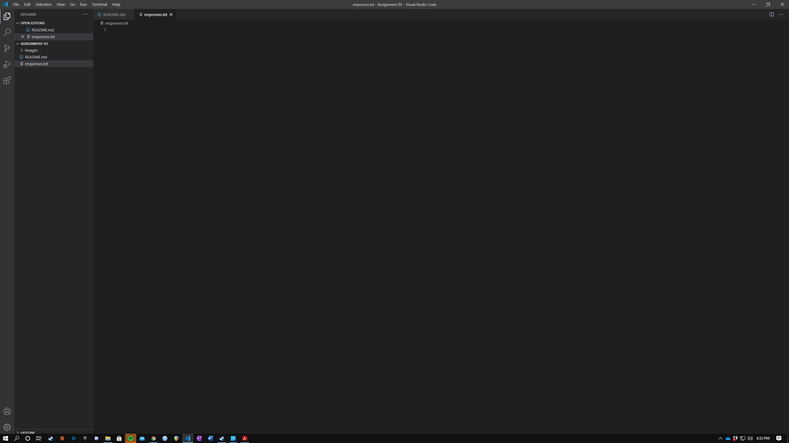

# Assignment 3
## Austin Cook

I decided to take this class because I have enjoyed the tiny amount of experience that I have with CSS and HTML. As you know, I was in your mobile-game development class last semester.
While I was there, I got to spend a lot of time with CSS and HTML for the Innovate High School app that we were developing, and I thought that I could see myself doing more of that in 
the future. The job demand and security are also most certainly better than anything in the music industry, which is a career path that I also considered. I believe it would serve me well 
to more familiarize myself with the many languages of the almighty computer.

Three Things I learned (Or Hope to Learn):
- I learned that image links require an exclamation point in markdown!
- I learned how to make an ordered and and unordered list in markdown.
- I have realized that markdown on its own is much simpler than HTML and Javascript (at least so far), and I look forward to learning more about it.

[You wanna headbang?](https://www.youtube.com/watch?v=iPU-vXOUe4I)

[My Responses](./responses.txt)

