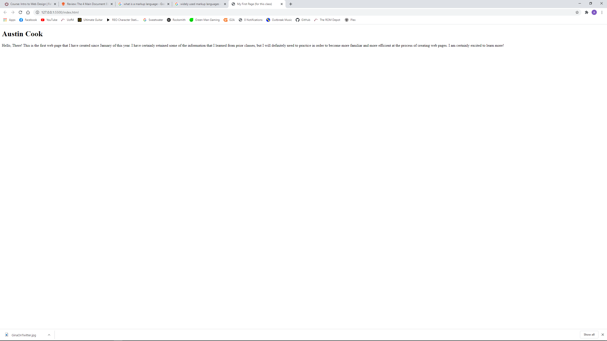

Briefly detail how browsers function. - A web browser essentially acts as a liaison between web pages and and the pc user. The browser collects and interprets data from a web page (html, css, javascript) and then displays them for the user to observe and interact with. I personally have used Google Chrome since around the time of its release. I do not remember why I switched over to it in the first place, but it has been working fine for me!

What is a markup language? - A markup language determines the style and layout of a webpage. It focuses primarily on, but is not exclusive to, text. The most commonly used markup language is HTML. It serves as the foundation of a web page and is regularly used with Stylesheets and scripts.

 