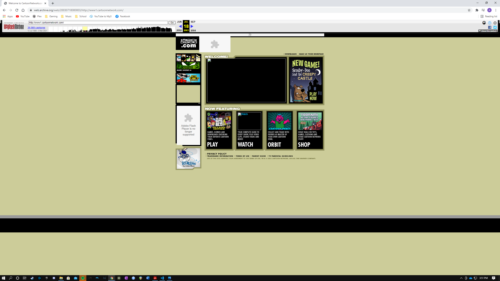
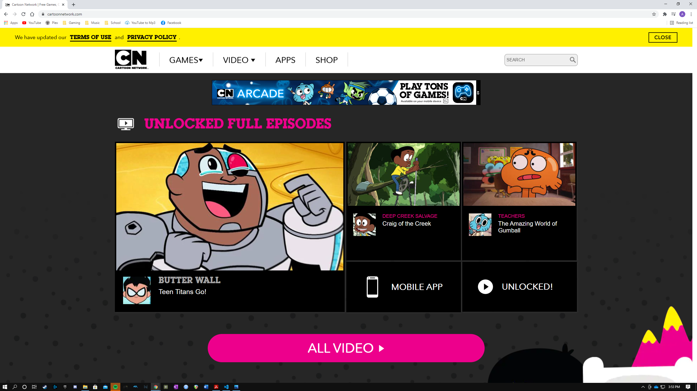
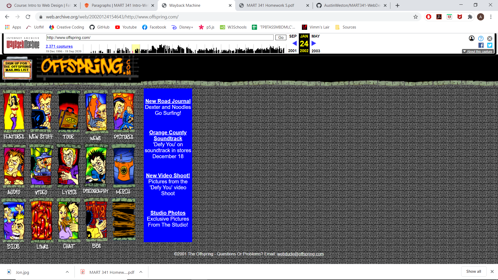

When I got the internet as a little kid in 2002, there was only one website that I ever visited, and it was [offspring.com](offspring.com). I was obsessed with the band when I was younger, I would frequently go on there for updates, photos, music videos, and to visit the chat rooms and talk to other fanatics about the band. Back then, there was not really any other place that I knew of where I could get the bands content that I wanted. Nowadays, every band or artist operates almost entirely out of their Facebook page. So now, the webpage exists moreso for the news updates and maybe some tour info. The chatrooms are obsolete, and you can find much more convenient ways to see photos of the band or watch their music videos. 

I also recall occasionally going to Cartoon Network's website, [cartoonnetwork.com](cartoonnetwork.com), during study hall as a child, when I was allowed to play computer games after finishing my homework. This website had a lot of flash games that no longer exist due to the discontinuation of Adobe Flash. The new site still has a large library of games, but they do not use Adobe Flash and are focused on all of the networks newer shows. The games from the shows that I grew up with are no longer available.

I do not really have any concerns besides maybe being intimidated by the differences between the markdown and html languages, but I'm sure I willl catch on real quick.

